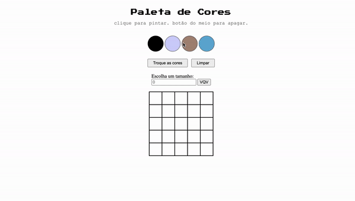

## Pixels Art 🎨:

## About:

Small project developed at the beginning of the <b>Web Development Fundamentals module</b> at Trybe.

The goal was to create a pixel-art board, where users could select colors from random-generated ones and click on a blank square to paint it.

Additionally, there is an option for users to generate new random colors, change the size of the board, and erase a click with a middle-button click.

It was made using <b>HTML</b>, <b>CSS</b> and <b>Javascript</b>.

You can <a href="https://luacomacento.github.io/pixels-art/" target="_blank">click here</a> to check the current state of the application.

## Tools:
<ul>
  <li>Javascript ES6+</li>
  <li>HTML5</li>
  <li>CSS3</li>
</ul>

## In works:
As of now, I am no longer working on this project.
